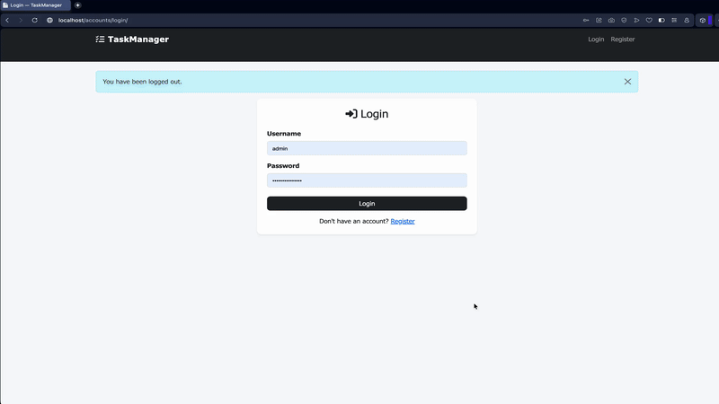
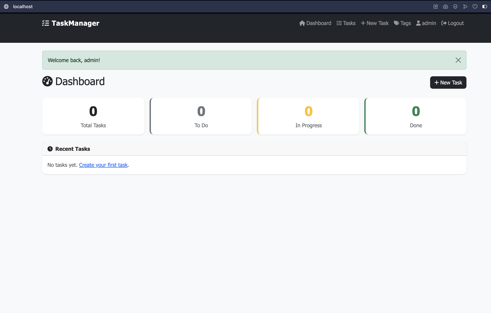
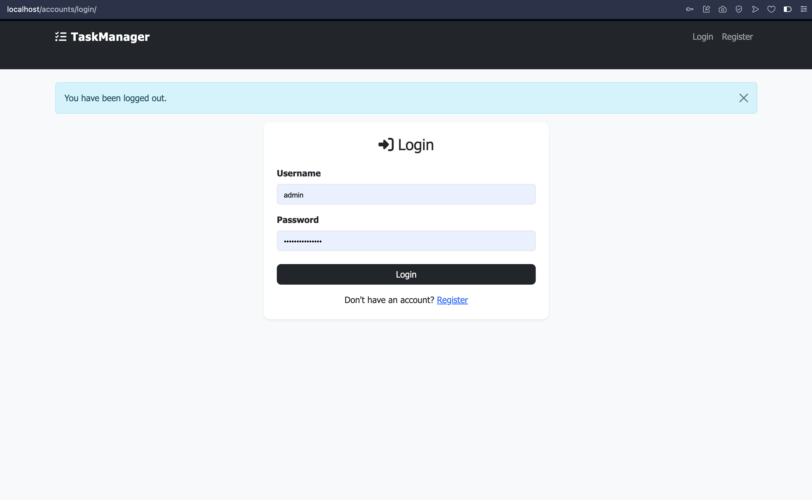
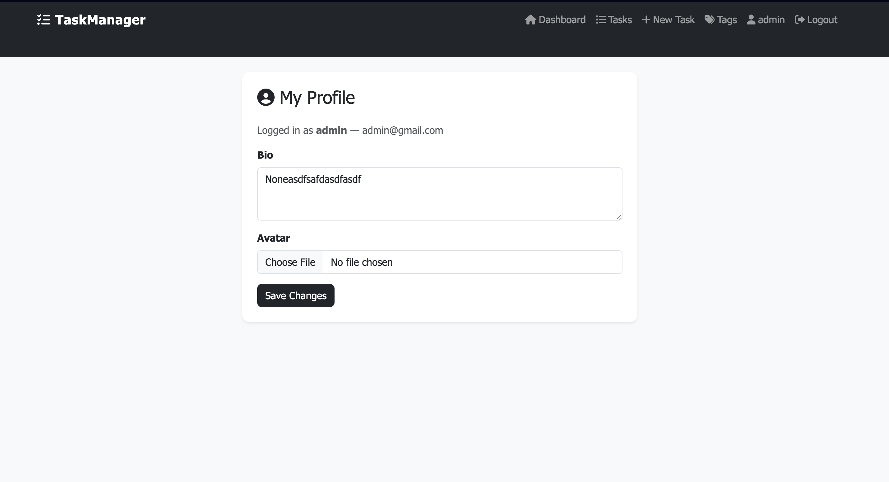
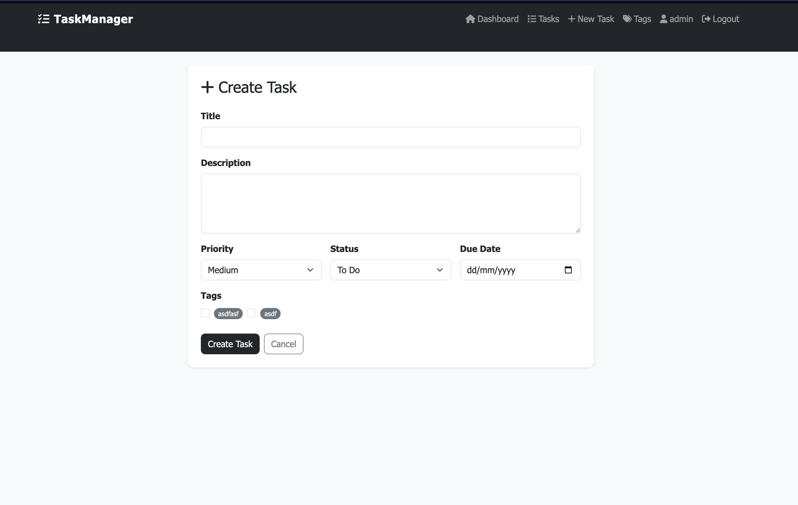
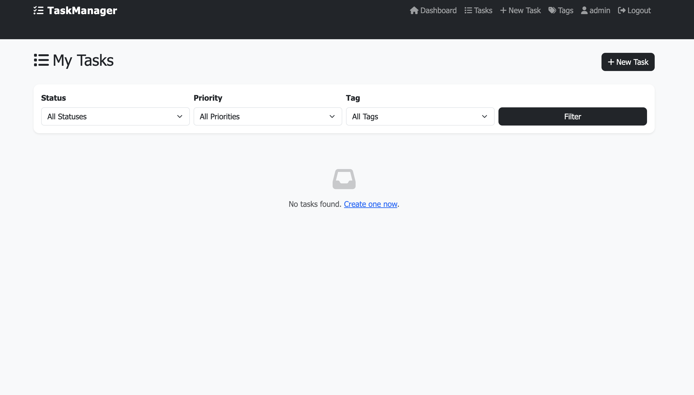

# TaskManager

A full-stack task management web application built with Django, containerized with Docker, and deployed on Google Cloud Platform with HTTPS and a complete CI/CD pipeline.

 **Live at:** https://taskmanager-00015775.duckdns.org 
 * **Username**: admin
 * **Password**: admin

**Docker Image:** https://hub.docker.com/repository/docker/00015775/taskmanager/ (_under 200MB_)

## Features

- User authentication (register, login, logout, profile management)
- Create, read, update, and delete tasks (full CRUD)
- Filter tasks by status, priority, and tag
- Tag management with custom colors
- Dashboard with real-time task statistics
- Admin panel for data management
- PostgreSQL database with many-to-one and many-to-many relationships
- Dockerized multi-service architecture (Django + PostgreSQL + Nginx)
- Automated CI/CD pipeline via GitHub Actions
- HTTPS enforced via Let's Encrypt (Certbot)

## Technologies Used

| Layer | Technology |
|---|---|
| **Backend** | Django 4.2, Python 3.11, Gunicorn |
| **Database** | PostgreSQL 15 |
| **Frontend** | Bootstrap 5, Font Awesome |
| **Containerization** | Docker, Docker Compose |
| **Web Server** | Nginx (reverse proxy + static files) |
| **CI/CD** | GitHub Actions |
| **Cloud** | Google Cloud Platform (GCP) — Ubuntu 24.04 LTS |
| **SSL** | Let's Encrypt (Certbot) |
| **DNS** | DuckDNS (free subdomain) |

## Local Setup Instructions

### Prerequisites
- Python 3.11+
- Docker Desktop
- Git

### Option A — Run with Docker (recommended)

1. Clone the repository:
```bash
git clone https://github.com/00015775/taskmanager.git
cd taskmanager
```

2. Create your `.env` file from the example:
```bash
cp .env.example .env
```

3. Edit `.env` with your values (see Environment Variables section below)

4. Build and start all containers:
```bash
docker compose up --build
```

5. Visit `http://localhost` in your browser

6. Create a superuser for admin access:
```bash
docker compose exec web python manage.py createsuperuser
```

### Option B — Run locally without Docker

1. Clone and enter the project:
```bash
git clone https://github.com/00015775/taskmanager.git
cd taskmanager
```

2. Create and activate virtual environment:
```bash
python3 -m venv venv
source venv/bin/activate
```

3. Install dependencies:
```bash
pip install -r requirements.txt
```

4. Run migrations:
```bash
python manage.py migrate
```

5. Start the development server:
```bash
python manage.py runserver
```

6. Visit `http://127.0.0.1:8000`

## Environment Variables

Copy `.env.example` to `.env` and fill in the values:

| Variable | Description | Example |
|---|---|---|
| `SECRET_KEY` | Django secret key — keep this secret | `your-50-char-random-key` |
| `ALLOWED_HOSTS` | Comma-separated list of allowed hosts | `localhost,127.0.0.1,yourdomain.duckdns.org` |
| `POSTGRES_DB` | PostgreSQL database name | `taskmanager` |
| `POSTGRES_USER` | PostgreSQL username | `taskmanager_user` |
| `POSTGRES_PASSWORD` | PostgreSQL password | `strongpassword` |
| `POSTGRES_HOST` | PostgreSQL host (use `db` inside Docker) | `db` |
| `POSTGRES_PORT` | PostgreSQL port | `5432` |
| `SECURE_SSL_REDIRECT` | Enable HTTPS redirect — True in production | `False` |

## Deployment Instructions

### Server Requirements
- Ubuntu 24.04 LTS (GCP VM)
- Docker + Docker Compose installed
- Ports 22, 80, 443 open in UFW and GCP firewall rules
- Domain pointed to server IP (DuckDNS or any DNS provider)

### Steps

1. SSH into your server:
```bash
ssh -i ~/.ssh/your_key username@your-server-ip
```

2. Install Docker:
```bash
sudo apt update && sudo apt install -y ca-certificates curl gnupg
curl -fsSL https://download.docker.com/linux/ubuntu/gpg | sudo gpg --dearmor -o /etc/apt/keyrings/docker.gpg
sudo apt update && sudo apt install -y docker-ce docker-ce-cli containerd.io docker-compose-plugin
sudo usermod -aG docker $USER
```

3. Clone the repository:
```bash
git clone https://github.com/00015775/taskmanager.git
cd taskmanager
```

4. Create production `.env`:
```bash
cp .env.example .env
nano .env
```

5. Start containers:
```bash
docker compose up -d
```

6. Install SSL certificate via Certbot:
```bash
sudo apt install -y certbot
sudo systemctl stop nginx     # stop system nginx if running
sudo certbot certonly --standalone -d yourdomain.duckdns.org \
  --non-interactive --agree-tos --email your@email.com
```

7. Set `SECURE_SSL_REDIRECT=True` in `.env` and restart:
```bash
docker compose restart web
```

### CI/CD Automatic Deployment

Every push to `main` automatically deploys to production. Required GitHub Secrets:

| Secret | Description |
|---|---|
| `DOCKERHUB_USERNAME` | Docker Hub username |
| `DOCKERHUB_TOKEN` | Docker Hub access token |
| `SSH_HOST` | GCP server IP address |
| `SSH_USERNAME` | Server SSH username |
| `SSH_PRIVATE_KEY` | Private SSH key for server access |
| `ALLOWED_HOSTS` | Production allowed hosts value |

## Project Structure

```
taskmanager/
├── .github/
│   └── workflows/
│       └── deploy.yml          # CI/CD pipeline
├── accounts/                   # Authentication app (register, login, logout, profile)
├── tasks/                      # Task management app (CRUD, tags, filtering)
├── core/                       # Dashboard and shared views
├── taskmanager/                # Django project settings
│   └── settings/
│       ├── base.py             # Shared settings
│       ├── development.py      # Local development (SQLite)
│       └── production.py       # Production (PostgreSQL, security headers)
├── templates/                  # HTML templates
├── static/                     # CSS, JS assets
├── nginx/
│   └── nginx.conf              # Nginx reverse proxy + SSL config
├── docker/
│   └── entrypoint.sh           # Container startup script
├── conftest.py                 # Pytest configuration
├── Dockerfile                  # Multi-stage build
├── docker-compose.yml          # Production services
├── docker-compose.dev.yml      # Development services
├── .env.example                # Environment variable template
└── README.md
```

## Database Models

| Model | App | Relationships |
|---|---|---|
| `UserProfile` | accounts | OneToOne → User |
| `Task` | tasks | ManyToOne → User (owner) |
| `Tag` | tasks | ManyToMany ↔ Task |

## Running Tests

```bash
# Run all tests locally
pytest --tb=short -v

# Run with coverage report
coverage run -m pytest
coverage report

# Run inside Docker
docker compose exec web pytest
```

25 tests covering models, views, authentication, CRUD operations, and data isolation between users.

## CI/CD Pipeline

Every push to `main` branch automatically:

1.  Runs flake8 code quality checks
2.  Runs 25 pytest tests
3.  Generates coverage report (minimum 60%)
4.  Builds Docker image (multi-stage, non-root user)
5.  Tags image with `latest` and commit SHA
6.  Pushes image to Docker Hub
7.  Deploys to GCP server via SSH
8.  Runs database migrations
9.  Collects static files
10.  Restarts services with zero downtime

## Screenshots

<p align="center">
  
</p>

<p align="center">
  
  
  
  
  
</p>

## Running Tests
```bash
# Without Docker
pytest

# With Docker
docker compose exec web pytest
```

## CI/CD Pipeline

Every push to `main` branch automatically:
1. Runs code quality checks (flake8)
2. Runs all tests (pytest)
3. Builds Docker image
4. Pushes image to Docker Hub
5. Deploys to production server via SSH
6. Runs migrations and restarts services


## Troubleshooting

In case of errors at first stage of testing `Run Tests & Linting`, the most common reason are design related issues such as whitespace errors or blanks. To solve this, do as follows: 
1. `python3.11 -m venv venv`
2. `source venv/bin/activate` 
3. `pip install -r requirements.txt`
  
First check locally if it is actuall whitespace or blank issues, to do this run:
```
flake8 . --max-line-length=120 \
         --exclude=venv,migrations,staticfiles,__pycache__ \
         --count --statistics
```
If you see whitespace/blank errors, the run:
```
# Auto-fix all whitespace issues across the whole project
autopep8 --in-place --recursive \
  --select=W291,W292,W293,W391 \
  --exclude=venv,migrations,staticfiles \
  .
```

